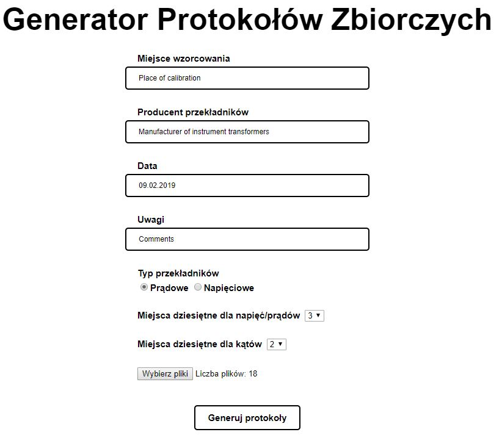
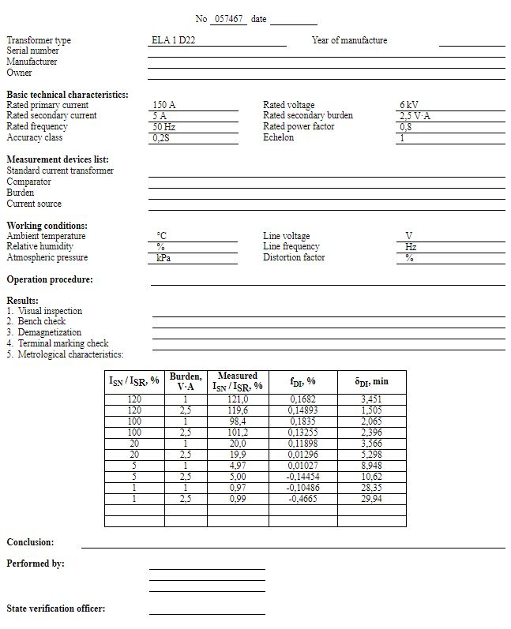
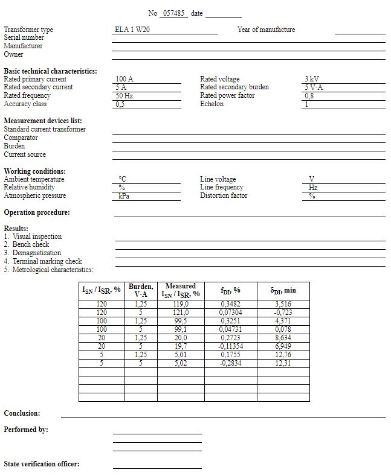
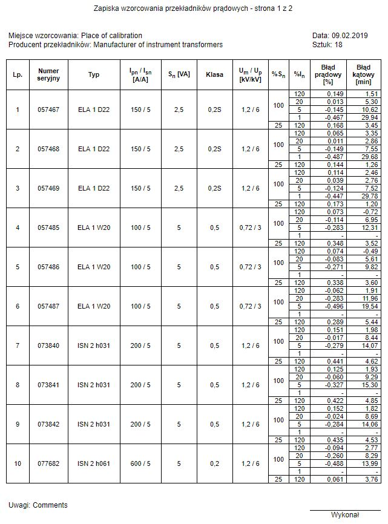
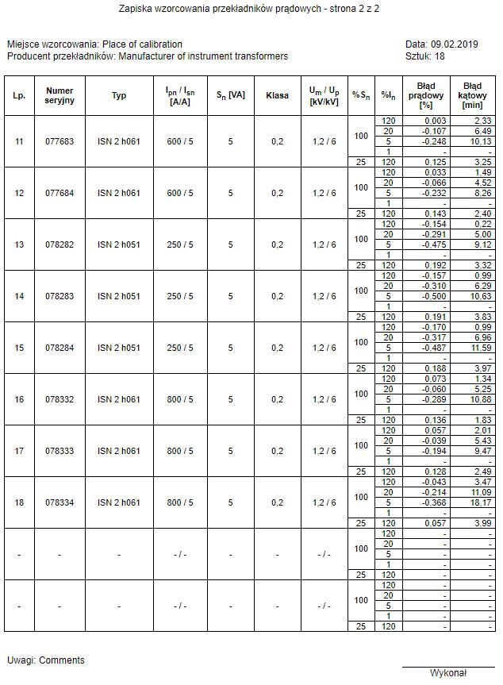

# Generator Protokołów Zbiorczych (collective reports generator)

## Table of contents
* [General info](#general-info)
* [Features](#features)
* [Inspiration](#inspiration)
* [Screenshots](#screenshots)
* [Technologies](#technologies)
* [Setup](#setup)
* [Status](#status)
* [Contact](#contact)

## General info
This program converts multiple *instrument transformer measurement report* files generated by *M100_PC_v3.6E* (PC software for controlling instrument transforment measurement device) to one collective report, which includes information required by Polish *Central Office of Measures*, to carry out instrument transformer calibration.

Collective report is divided into single, easy to print pages. Each page contains information about 10 instrument transformers.

Input files are html reports generated by *M100_PC_v3.6E*. To generate report, *M100_PC_v3.6E* uses templates (created in MS Word), in which it replaces special tags (for example *$1$*) with instrument transformer parameters and measured values. I modified those templates by adding required tags at the end of template, in easy to extract form. Those additional tags are commented out, so the look of report is not changed. Modified templates are attached in *M100_PC_modified_templates* folder.

This program works similarly to *M100_PC_v3.6E*. It extracts information from my additional tags in report files and put it in output files, by replacing another tags in templates (those tags begins and ends with exclamation mark). Output collective report is in html format, divided into single pages, which you can easily print in Internet browser or edit in MS Word. You can change the look of collective report by modifying templates located in *templates* folder.

## Features
* insert information about place of calibration, instrument transformer manufacturer, date (today's date is default value), and additional comments
* choose type of instrument transformer (current transformer or voltage transformer)
* choose number of decimal places for voltage/current values and separately for angle values
* add folder containing report files generated by *M100_PC_v3.6E* program
* download collective report divided into single A4 pages, in single zip archive

## Inspiration
I created this program to make work I did in my job easier and faster. Before, collective reports were made manually, by copying each neccesary information from each report to MS Word. Now you just select folder with reports and click "generate report" and it is done.

## Screenshots

### Main interface of  the program

### Example report file (input)

### Another example file

### Example colletive report file (output), page 1/2

### Example colletive report file (output), page 2/2

## Technologies
* HTML 5
* CSS 3
* PHP 7

## Setup
1. Copy all files to your PHP-configured web server.
2. Change values of following parameters in your php.ini file:  
`post_max_size = 1G`  
`upload_max_filesize = 1G`  
`max_file_uploads = 1000`
3. If you are using nginx web server you also need to add following line in nginx.conf file:  
`client_max_body_size 1G;`
4. Example report (input) files generated by *M100_PC_v3.6E* program are stored in example_reports.7z archive

## Status
Project is: **finished**

## Contact
Created by [@RafalMroz94](https://github.com/RafalMroz94)  
Feel free to contact me via e-mail: rafal.mroz@outlook.com
